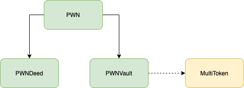
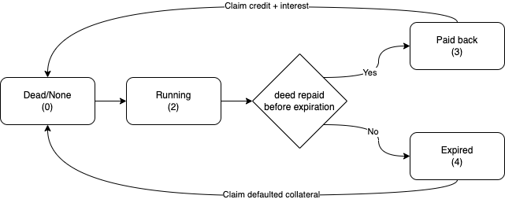
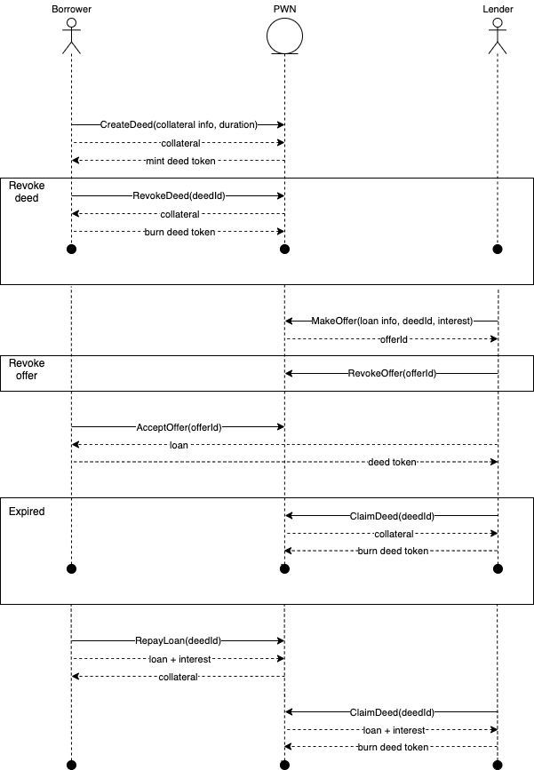

# PWN Finance
Smart contracts enabling p2p loans using arbitrary collateral (supporting ERC20, ERC721, ERC1155 standards).

## Architecture

### PWN (logic)
PWN is the core interface users are expected to use (also the only interactive contract allowing for premissionless external calls). 
The contract defines the workflow functionality and handles the market making. Allowing to:
- Create and revoke Deeds 
- Make, revoke or accept credit offers 
- Pay back loans
- Claim collateral or credit

### PWN Deed 
PWN Deed is an PWN contextual extension of a standard ERC1155 token. Each Deed is defined as an ERC1155 NFT. 
The PWN Deed contract allows for reading the contextual information of the Deeds (like status, expirations, etc.) 
but all of its contract features can only be called through the PWN (logic) contract. 

### PWN Vault
PWN Vault is the holder contract for the locked in collateral and paid back credit.
The contract can only be operated through the PWN (logic) contract. 
All approval of tokens utilized within the PWN context has to be done towards the PWN Vault address - 
as ultimately it's the contract accessing the tokens. 

### MultiToken library
The library defines a token asset as a struct of token identifiers. 
It wraps transfer, allowance & balance check calls of the following token standards:
- ERC20
- ERC721 
- ERC1155

Unifying the function calls used within the PWN context (not having to worry about handling those individually).

### High level contract architecture

## PWN Deed
PWN Deed token is a tokenized representation of a loan which can aquire different states:
- Dead/None - Deed is not created or have been claimed and can be burned.
- Open - Deed is created and is accepting offers.
- Running - Deed has an accepted offer and expiration date, which is set at the time of acceptance.
- Paid back - Deed had been fully paid back before expiration date. Deed owner is able to claim lended credit + interest.
- Expired - Deed had not been fully paid back before expiration date. Deed owner is able to claim collateral.

### State diagram

## User flow
Following diagram shows deed lifecycle with borrower, lender and pwn protocol interactions.

## Deployed addresses
#### Mainnet
- PWN deployed at: _0x09c20b357dce2656253e91342a459a2253f69c29_
- PWNDeed deployed at: _0x9Eb96D50a6D2Af5771883547dae092996828BE73_
- PWNVault deployed at: _0x45DB28b2d4878Ad124c037d4558AcF5Db3bBa6A5_

#### Rinkeby testnet
- PWN deployed at: _0xdB41a9D0Ae5cBEE58b3e2D00DA6Bd1eB323B92e8_
- PWNDeed deployed at: _0x4704A3492F3c839B88fB3920ddAff8b3a6F4f7bC_
- PWNVault deployed at: _0xA1ECA77e64a348B28E1aadf2Bf56D1Eb68Ca518e_
