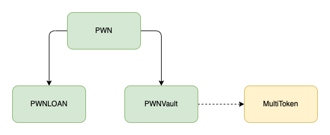
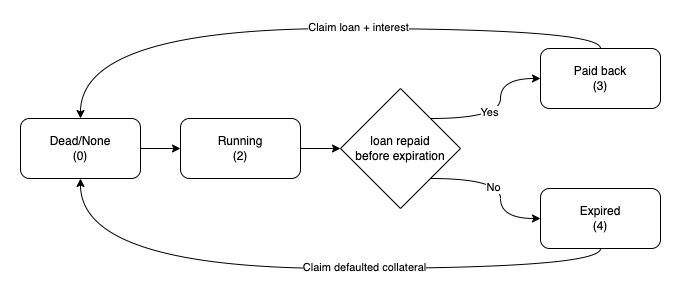
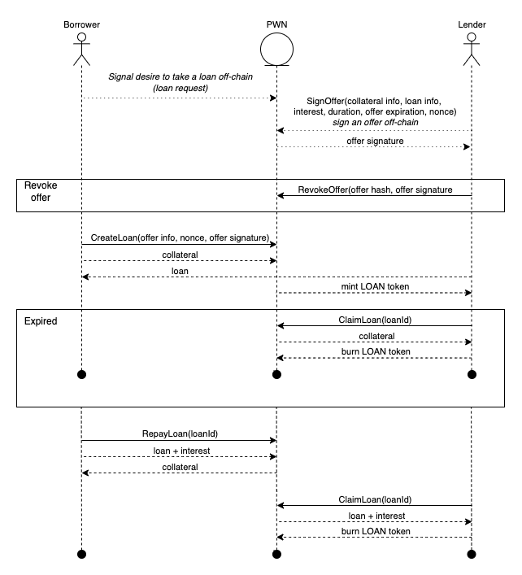

# PWN Finance
Smart contracts enabling p2p loans using arbitrary collateral (supporting ERC20, ERC721, ERC1155 standards).

## Architecture
### PWN (logic)
PWN is the core interface users are expected to use (also the only interactive contract allowing for permissionless external calls).
The contract defines the workflow functionality and handles the market making. Allowing to:
- Create loans with off-chain signed offer
- Pay back loans
- Claim collateral or credit

### PWN LOAN
PWN LOAN is an PWN contextual extension of a standard ERC1155 token. Each LOAN is defined as an ERC1155 NFT.
The PWN LOAN contract allows for reading the contextual information of the LOANs (like status, expirations, etc.)
but all of its contract features can only be called through the PWN (logic) contract. 

### PWN Vault
PWN Vault is the holder contract for the locked in collateral and paid back credit.
The contract can only be operated through the PWN (logic) contract. 
All approval of tokens utilized within the PWN context has to be done towards the PWN Vault address - 
as ultimately it's the contract accessing the tokens. 

### MultiToken library
https://github.com/PWNFinance/MultiToken
The library defines a token asset as a struct of token identifiers. 
It wraps transfer, allowance & balance check calls of the following token standards:
- ERC20
- ERC721 
- ERC1155

Unifying the function calls used within the PWN context (not having to worry about handling those individually).

### High level contract architecture

## PWN LOAN
PWN LOAN token is a tokenized representation of a loan which can aquire different states:
- Dead/None - LOAN is not created or have been claimed and can be burned.
- Running - LOAN is created by passing offer data and offer siganture signed by a lender.
- Paid back - LOAN had been fully paid back before expiration date. LOAN owner is able to claim lended credit + interest.
- Expired - LOAN had not been fully paid back before expiration date. LOAN owner is able to claim collateral.

### State diagram

## User flow
Following diagram shows loan lifecycle with borrower, lender and pwn protocol interactions.

1. Borrower starts by signaling desire to take a loan with desired loan parameters (collateral asset, loan asset, amount, duration).
2. Lender makes an offer to arbitray asset and signs it off-chain. Lender can revoke singed offer anytime by making on-chain transaction.
3. Borrower can accept any offer which is made to collateral he/she owns.

    a) collateral is transferred to PWNVaul contract (should be approved for PWNVault)

    b) loan asset is transferred from lender to borrower (should be approved for PWNVault)

    c) LOAN token is minted to represent a loan and transferred to a lender

4. Borrower should repay a loan anytime before expiration.

    a) repay amount is transferred to PWNVault contract (should be approved for PWNVault)

    b) collateral is transferred back to borrower

5. LOAN owner can claim repay amount.

    a) repay amount is transferred to a LOAN owner

    b) LOAN token is burned

6. In case borrower is not able to repay loan in time, lender can claim borrowers collateral and borrower keeps the loan asset.

## Offer types
Lender can choose between two types while making an offer. Basic and flexible.

### Basic
Basic offer is where lender is setting all loan parameters up-front and borrower has an option to accept of not. Nothing else.

### Flexible
With flexible offers, lender can give borrower additional flexibility by not providing concrete values but rather give borrower ranges for several parameters. When accepting an offer, borrower has to provide concrete values to proceed. This increases a lenders chance to have their offer accepted as it could be accepted by more borrowers.

Flexible parameters are: collateral id, loan amount, loan duration.

## Deployed addresses
### Ethereum
- PWN: `0x0709b8e46e26b45d76CC5C744CAF5dE70a82578B`
- PWNLOAN: `0xcFe385287200F0c10a54100e9b22855A73664156`
- PWNVault: `0xb98efe56decceb1bec9faeeaf62500deb0953474`

### Polygon
- PWN: `0xBCdE56e9FB8c30aBB2D19Fb33D7DeD5031102da2`
- PWNLOAN: `0x8680AEE63E48AACB51Ddc5Ad15979FC169C1cf2B`
- PWNVault: `0xaF0d978275a2e7e3109F8C6307Ffd281774C623E`

### Rinkeby testnet
- PWN: `0x34fCA53BbCbc2a4E2fF5D7F704b7143133dfaCF7`
- PWNLOAN: `0xC33B746Ac85703178D5a796f960b5e855172e7F7`
- PWNVault: `0x2f705615E25D705813cC0E29f4225Db0EDB82eCa`

### Mumbai (Polygon) testnet
- PWN: `0xDa88e79E5Dd786AD3c29CeFbe6a2bece6f6c0477`
- PWNLOAN: `0x7C995e64a24aCb5806521276697B244D1f65f708`
- PWNVault: `0x2fd4B676192C701778724408B72e9A29af2eB8c0`

### OpenSea shortcuts
- PWN LOANs Listings: https://opensea.io/collection/TBD
- Collateral Collection: https://opensea.io/TBD

# PWN is hiring!
https://www.notion.so/PWN-is-hiring-f5a49899369045e39f41fc7e4c7b5633
